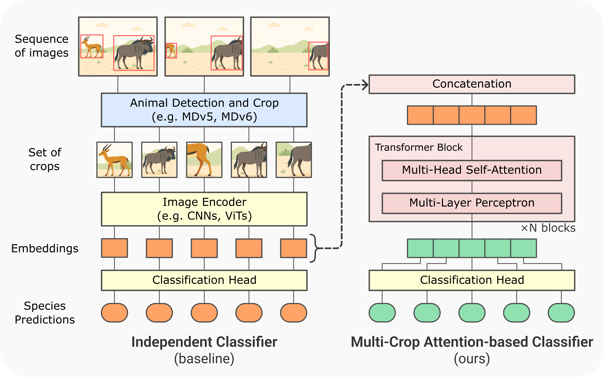
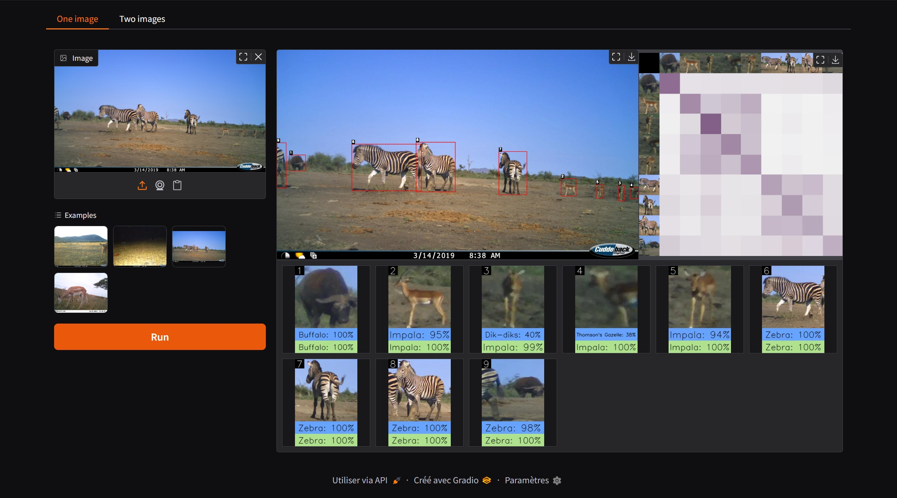

<div align="center">
<h1>Paying Attention to Other Animal Detections Improves Camera Trap Classification Models</h1>

<a href="https://www.biorxiv.org/content/10.1101/2025.07.15.664849v1"></a>
<a href='https://huggingface.co/spaces/gdussert/MCA_Classifier'></a>


**[LBBE](https://lbbe.univ-lyon1.fr/fr)**; **[CEFE](https://www.cefe.cnrs.fr/fr/)**; **[LECA](https://leca.osug.fr/)**


[Gaspard Dussert](https://gdussert.github.io/), [Stéphane Dray](https://sdray.github.io/), [Simon Chamaillé-Jammes](https://simonchamaillejammes.mystrikingly.com/), [Vincent Miele](https://vmiele.gitlab.io/)
</div>

## Overview

Multi-Crop Attention-based Classifier uses self-attention to improve classification by levaring the context of other detection within the camera trap sequence. 



## Quick Start

Clone this repository and install the dependencies.

```bash
git clone git@github.com:gdussert/MCA_Classifier.git
cd MCA_Classifier
pip install -e .
```

## Interactive Demo



#### On Hugging Face

Try out the demo without any installation on [Hugging Face](https://huggingface.co/spaces/gdussert/MCA_Classifier).

#### On your local machine

Download the models:

```bash
bash download_models.sh
```

Then run the demo:

```bash
python gradio_demo.py
```

## Training and testing

Download the data on [Zenodo](https://zenodo.org/records/15736090) and put them in `data/`.

Each zip file includes the crop embeddings of several datasets:

* `serengeti_train.zip`: training set of Snapshot Serengeti (8.9GB)
* `serengeti_test.zip`: test set of Snapshot Serengeti (3.4GB)
* `serengeti_toy.zip`: toy dataset to quickly test all the scripts, it contains only the pictures of Snapshot Serengeti camera trap location C12 (45.3MB)
* `safari2024.zip`: whole Snapshot Safari 2024 Expansion dataset (4.6GB)

The data directory structure should look like this:

```md
.
├── data/
│   ├── serengeti_train/
│   │   ├── metadata.csv
│   │   ├── embeddings.bl2
│   │   └── scores.bl2
│   ├── serengeti_test/
│   │   └── ...
│   ├── serengeti_toy/
│   │   └── ... 
│   ├── safari2024/
│   │   └── ...
│   └── crop_images/
│       └── lilaser/
├── models/
│   ├── crop_classifier.pt
│   ├── mca_classifier.pt
│   └── MDV6-yolov10-e-1280.pt
└── mca_clasifier/
    └── ...
```

Both datasets being very large, `crop_images.zip` includes only the picture of `serengeti_toy`.

#### Training

```bash
python train.py --dataset $DATASET
```

#### Testing

```bash
python test.py --dataset $DATASET --dataset_type $DATASET_TYPE
```

With `$DATASET_TYPE` being either `real` or `synthetic`.

## Cite us

```bibtex
@misc{dussert2025attention,
	author = {Dussert, Gaspard and Dray, Stéphane and Chamaillé-Jammes, Simon and Miele, Vincent},
	title = {Paying Attention to Other Animal Detections Improves Camera Trap Classification Models},
	year = {2025},
	doi = {10.1101/2025.07.15.664849},
	publisher = {bioRxiv},
	type = {preprint},
}
```

## Acknowledgements

This work was granted access to the HPC resources of IDRIS under the allocation 2022-AD010113729 made by GENCI.

Thanks to [LILA BC](https://lila.science/) for hosting the two datasets, [Snapshot Safari 2024 Expansion](https://lila.science/datasets/snapshot-safari-2024-expansion/) and [Snapshot Serengeti](https://lila.science/datasets/snapshot-serengeti), and for all those who contributed to it.

Thanks [MegaDetector](https://github.com/agentmorris/MegaDetector) and [PytorchWildlife](https://github.com/microsoft/CameraTraps): MDv5a was used for preprocessing and MDV6-Ultralytics-YoloV10-Extra is used by the Gradio demo.

Thanks to the amazing [timm](https://github.com/huggingface/pytorch-image-models) repository. 
